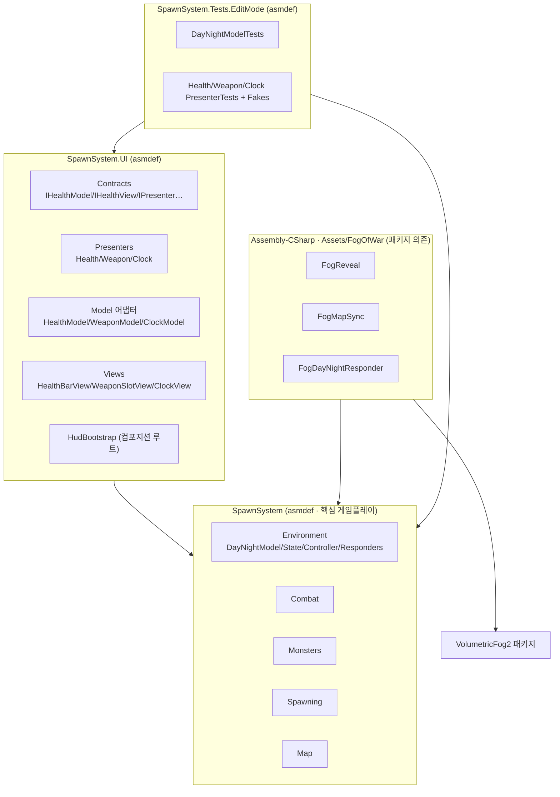
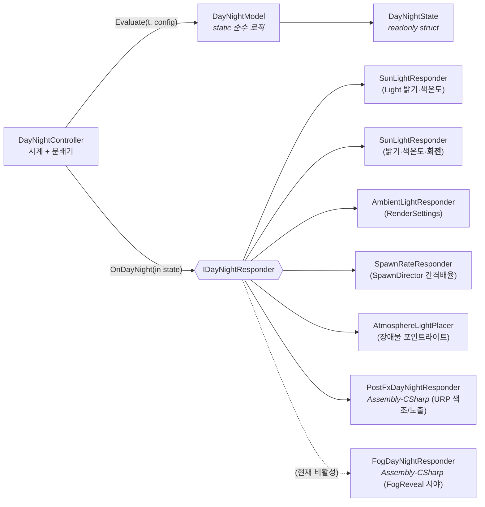
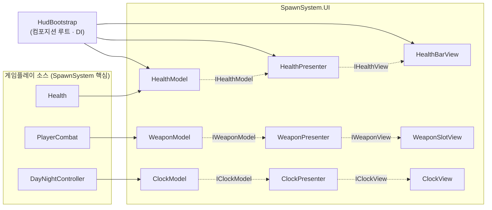
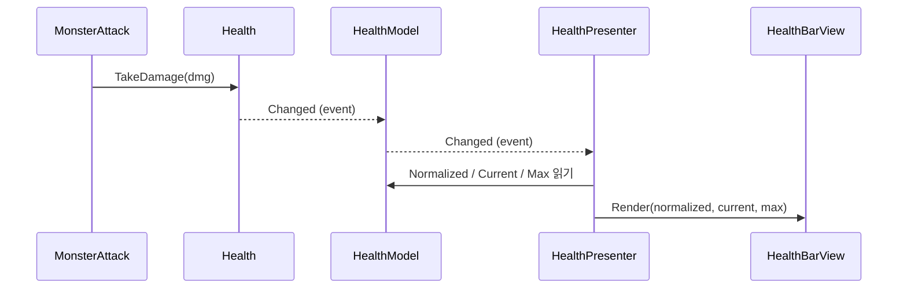

# 아키텍처 문서 — SOLID 레이어링 · 낮/밤 시스템 · MVP HUD

이 문서는 [GameDesign.md](GameDesign.md)의 기획(특히 §2 시야/안개, §3 낮/밤, §4 전투, §4.5 HP UI)을
**객체지향 SOLID 원칙**으로 구현한 구조와, 그 위에 올린 **MVP 패턴 HUD**, 그리고 이를 검증하는
**테스트 프레임워크**를 설명한다.

> 한 줄 요약: *순수 로직(시임) → 이를 구동하는 MonoBehaviour → 추상 인터페이스로 분리된 반응자/뷰*.
> 의존성은 항상 **안쪽(핵심 게임플레이)으로만** 흐른다.

---

## 1. 어셈블리 레이어링 (의존성 방향)

| 어셈블리 | 역할 | 참조 |
|---------|------|------|
| `SpawnSystem` | 핵심 게임플레이 + 낮/밤 시뮬레이션 (UnityEngine 코어만 사용) | Navigation, InputSystem |
| `SpawnSystem.UI` | MVP HUD (uGUI 사용) | `SpawnSystem`, `UnityEngine.UI` |
| Assembly-CSharp (`Assets/FogOfWar`) | VolumetricFog2 패키지와 핵심을 잇는 브리지 | 모든 것 + VolumetricFog2 |
| `SpawnSystem.Tests.EditMode` | 순수 로직 + Presenter 단위 테스트 | `SpawnSystem`, `SpawnSystem.UI` |

**핵심 규칙**: `SpawnSystem`(핵심)은 UI도, VolumetricFog 패키지도 **모른다**. 바깥 레이어가
안쪽 추상에 의존할 뿐이다 → 의존성 역전(DIP)이 어셈블리 단위로 강제된다.

---

## 2. SOLID 원칙 적용 지점

| 원칙 | 적용 | 위치 |
|------|------|------|
| **S**RP (단일 책임) | 시계(Controller)·계산(Model)·적용(각 Responder)·표시(View)·중재(Presenter)가 각각 한 가지만 함 | 전반 |
| **O**CP (개방-폐쇄) | 새 환경 반응을 추가할 때 `IDayNightResponder`만 구현하면 됨. 컨트롤러 수정 불필요 | `IDayNightResponder` |
| **L**SP (리스코프) | 모든 Responder는 `DayNightResponderBehaviour`로 치환 가능, 모든 View는 인터페이스로 치환 가능 | Responder/View 계층 |
| **I**SP (인터페이스 분리) | 위젯별로 `IHealthView`/`IWeaponView`/`IClockView` 분리. 비대한 단일 UI 인터페이스 없음 | `Contracts/` |
| **D**IP (의존성 역전) | Presenter는 `IHealthModel`/`IHealthView` 추상에만 의존. 구체 타입은 `HudBootstrap`만 앎 | Presenters ↔ Bootstrap |

---

## 3. 낮/밤 시스템 (Observer + 순수 시임)

기획 §3.2 표(태양광/환경광/안개/시야/스폰)를 그대로 **순수 함수**로 고정하고,
MonoBehaviour는 "시간 진행"과 "값 적용"만 담당하도록 분리했다.

- **`DayNightModel`** (순수): `Evaluate(normalizedTime, config) → DayNightState`. 씬/시간 무관 → EditMode 단위 테스트. 프로젝트의 기존 시임(`TensionCalculator`, `DamageResolver`)과 동일 패턴. 태양 회전도 순수 함수 `SunRotation(t, yaw)`로 분리(하루 동안 X축 한 바퀴 → 정오 수직·자정 지평선 아래).
- **`DayNightController`**: 매 프레임 시각을 진행시키고 모델로 상태를 계산해, 등록된 반응자에 `in DayNightState`로 푸시. 구체 반응자를 전혀 모른다.
- **반응자(Observer)**: `DayNightResponderBehaviour`가 OnEnable에서 컨트롤러를 찾아 자가 등록. 등록 즉시 현재 상태를 1회 받아 동기화.
  - `SunLightResponder`: 밝기·색온도에 더해 `state.SunRotation`으로 태양을 **회전**(해가 하늘을 가로지름, 그림자 각도 변화).
  - `PostFxDayNightResponder`: 맵 전체 **색조**를 URP `ColorAdjustments`(색 필터/노출/채도)로 보간 — 낮은 중성·밝음, 밤은 청색·어둡고 탈색.
- **OCP의 실증(경계 넘는 확장)**: `PostFxDayNightResponder`·`FogDayNightResponder`는 **다른 어셈블리(Assembly-CSharp)**에서 핵심의 `IDayNightResponder`를 구현한다. 핵심 코드를 한 줄도 건드리지 않고 "URP 색 그레이딩", "안개 시야" 동작을 더했다.
- **볼류메트릭 안개(FoW)는 현재 비활성** — `VolumetricFog2` 사용 보류(`FogReveal`/`FogMapSync`/`FogDayNightResponder` 컴포넌트 disable). 맵이 또렷이 보이도록 하기 위한 일시 조치이며, 컴포넌트만 꺼서 되돌리기 쉽다.

낮/밤이 건드리는 기존 코드 변경은 단 하나 — `SpawnDirector.spawnIntervalScale`라는 노출 노브 1개뿐(디렉터 내부 로직은 불변).

---

## 4. MVP 패턴 HUD

HP / 무기 슬롯 / 낮·밤 시계 3개 위젯을 MVP로 구성했다. **로직은 Presenter에**, **View는 그리기만** 하는
humble object, **Model은 게임플레이 소스를 감싼 어댑터**다.

**데이터 흐름 (예: 피격 → HP바 갱신)** — Model/View가 인터페이스라 Presenter는 Unity UI를 전혀 모른다:

- **Model 어댑터**: `Health`·`PlayerCombat`·`DayNightController`의 변경 이벤트를 깔끔한 `IXModel.Changed`로 중계. (이를 위해 `Health.Changed`, `PlayerCombat.SlotChanged` 이벤트를 추가.)
- **Presenter**: 순수 C#. `Initialize()`에서 구독+첫 렌더, `Dispose()`에서 구독 해제. `UnityEngine.UI` 의존 없음 → 단위 테스트 가능.
- **View**: `IHealthView` 등 humble object. 받은 값을 uGUI(`Image`/`Text`)에 그리기만. 자기 위젯을 코드로 생성하는 `Create()` 팩토리 보유.
- **컴포지션 루트 `HudBootstrap`**: 유일하게 구체 타입을 모두 아는 곳. 런타임에 Canvas/View를 만들고 Model 어댑터를 Presenter에 **주입(DI)**, 수명주기를 관리. 씬에는 이 컴포넌트 1개만 두면 HUD 전체가 조립된다.

---

## 5. 테스트 프레임워크

기존 프로젝트의 TDD 관례(EditMode = 순수 로직, PlayMode = 통합)를 그대로 따른다.

| 테스트 | 대상 | 기법 |
|--------|------|------|
| `DayNightModelTests` (12) | 일조량 곡선·구간 경계·시각 wrap·낮밤 값 보간·**태양 회전** | 순수 함수 직접 호출 |
| `HealthPresenterTests` (4) | 초기 렌더·변경 재렌더·Dispose 후 무반응·널 인자 | 가짜 Model/View |
| `WeaponPresenterTests` (2) | 초기 슬롯·슬롯 변경 재렌더 | 가짜 Model/View |
| `ClockPresenterTests` (4) | 상태 변경 재렌더·시계 포맷·구간 라벨 | 가짜 Model/View |

- **테스트 더블**: `HudTestDoubles.cs`에 `FakeHealthModel`/`FakeHealthView` 등 손수 작성한 가짜. Presenter가 추상에만 의존하므로 모킹 프레임워크 없이 호출 횟수·전달 값을 검증.
- **MVP가 사주는 것**: "체력이 줄면 바가 갱신된다" 같은 UI 로직을 **씬·플레이모드·uGUI 없이** 밀리초 단위로 검증.
- 전체 EditMode 스위트 **115개 통과** (기존 94 + MVP/낮밤 18 + 태양 회전 3).

실행: Unity Test Runner → EditMode, 또는 MCP `run_tests(mode=EditMode, assembly_names=["SpawnSystem.Tests.EditMode"])`.

---

## 6. 씬 배선 (SpawnTestScene)

| GameObject | 컴포넌트 | 비고 |
|-----------|---------|------|
| `Directional Light` | `SunLightResponder` | 태양 밝기/색온도/**회전** |
| `DayNight` (신규) | `DayNightController` + `AmbientLightResponder` + `SpawnRateResponder` + `AtmosphereLightPlacer` + `PostFxDayNightResponder` + ~~`FogDayNightResponder`~~(disable) | 시계 허브 + 환경 반응자 |
| `GlobalVolume` | URP `Volume`(PostFX: Bloom + `ColorAdjustments`) | 맵 색조 그레이딩 대상 |
| `HUD` (신규) | `HudBootstrap` | 런타임에 Canvas/HUD 조립 |
| `Player` | (기존) `Health`, `PlayerCombat`(`muzzle`→`Muzzle`), ~~`FogReveal`~~(disable) | 발사 지점 = 얼굴의 `Muzzle` 자식 |

플레이 스모크 테스트: 콘솔 0 에러. 정오=해 수직·밝은 중성 톤, 자정=해 지평선 아래·청색 어두운 톤 + 장애물 분위기 라이트, 안개 없이 맵 또렷. 레이저는 `Muzzle`에서 발사(글로우 라이트 포함). HUD 좌하단 무기/HP, 우상단 시계 정상.

---

## 7. 새로 추가/수정된 파일

**신규 — 핵심 `Assets/Scripts/Environment/`**
`DayNightPhase` · `DayNightConfig` · `DayNightState` · `DayNightModel` · `IDayNightResponder` ·
`DayNightController` · `DayNightResponderBehaviour` · `SunLightResponder` · `AmbientLightResponder` ·
`SpawnRateResponder` · `AtmosphereLightPlacer`

**신규 — `Assets/Scripts/UI/`** (asmdef `SpawnSystem.UI`)
`Contracts/`(IPresenter, IHealthModel, IWeaponModel, IClockModel, IHudViews) ·
`Presenters/`(Health/Weapon/Clock) · `Models/`(Health/Weapon/Clock 어댑터) ·
`Views/`(UiBuilder, HealthBarView, WeaponSlotView, ClockView) · `HudBootstrap`

**신규 — Assembly-CSharp 브리지**: `Assets/FogOfWar/FogDayNightResponder` · `Assets/Environment/PostFxDayNightResponder`(URP 색조)

**신규 — 프리팹**: `Assets/Prefabs/Combat/LaserProjectile.prefab`(Rigidbody+SphereCollider(trigger)+Point Light+`LaserProjectile`)

**신규 — 테스트 `Assets/Tests/EditMode/`**: `DayNightModelTests` · `HudTestDoubles` · `HealthPresenterTests` · `WeaponPresenterTests` · `ClockPresenterTests`

**수정(최소 노브 추가)**: `Health`(Changed/Heal/Normalized) · `PlayerCombat`(SlotChanged·`muzzle`·프리팹 발사) ·
`SpawnDirector`(spawnIntervalScale) · `DayNightConfig`(sunYaw) · `DayNightModel`/`DayNightState`(SunRotation) ·
`SunLightResponder`(회전) · `RangedWeaponSO`(projectilePrefab) · `LaserProjectile`(글로우 라이트·프리팹 Spawn) ·
`SpawnSystem.Tests.EditMode.asmdef`(UI 참조)
